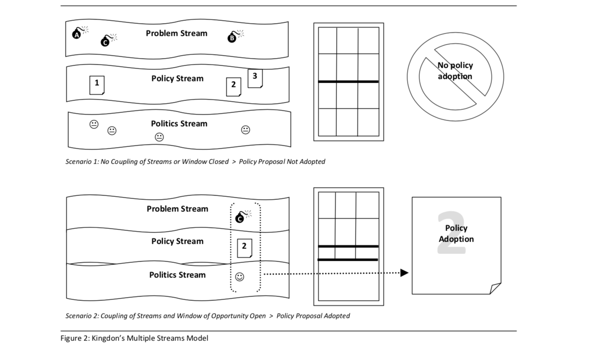
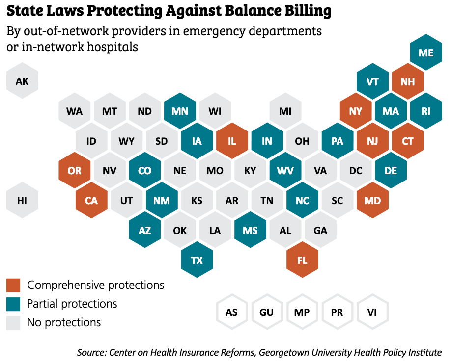

```{r setup, include=FALSE}
set.seed(12345)

# Links
#https://stanford.edu/~vbauer/teaching/revealjs.html
#https://rpubs.com/brandonkopp/creating-word-clouds-in-r


#Packages
library(tidyverse)
library(lubridate)
library(readtext)
library(RColorBrewer)
library(tm)
library(wordcloud)
library(tidytext)
library(hrbrthemes)
library(viridis)
library(networkD3)
```

```{r include=FALSE, eval=TRUE}

#Hearing Data Import

combined_testimony <- data.frame(matrix(nrow = 1, ncol = 4))
colnames(combined_testimony) = c("OIC", "Public", "Carriers", "Providers")
combined_testimony$OIC <- paste(as.character(readtext("data/*OIC.txt")$text), collapse = " ")
combined_testimony$Public <- paste(as.character(readtext("data/*public.txt")$text), collapse = " ")
combined_testimony$Carriers <- paste(as.character(readtext("data/*carrier.txt")$text), collapse = " ")
combined_testimony$Providers <- paste(as.character(readtext("data/*provider.txt")$text), collapse = " ")

combined_testimony <- combined_testimony %>% 
  gather(key = "group", value = "testimony")
  

docs <- Corpus(VectorSource(combined_testimony$testimony)) %>%
  tm_map(removePunctuation) %>%
  tm_map(removeNumbers) %>%
  tm_map(tolower)  %>%
  tm_map(removeWords, stopwords("english")) %>%
  tm_map(stripWhitespace) #%>%
  #tm_map(PlainTextDocument)

tdm <- TermDocumentMatrix(docs) %>%
  as.matrix()
colnames(tdm) <- c("OIC","Public","Carriers", "Providers")


#Sponsers
sponsors_1065 <- tribble(
  ~sponsor, ~party,
  "cody","d", 
  "jinkins", "d", 
  "riccelli", "d", 
  "wylie", "d", 
  "ormsby", "d", 
  "tharinger", "d", 
  "macri", "d", 
  "robinson", "d", 
  "slatter", "d", 
  "kloba", "d", 
  "valdez", "d", 
  "appleton", "d", 
  "doglio", "d", 
  "pollet", "d", 
  "stanford", "d", 
  "frame", "d", 
  "reeves", "d", 
  "bergquist", "d")
```

#Balance billing reform has been an exercise in patience, politics, and good policy. Now, all the hard work is paying off. 

#Why Balance Billing?

##Both personal and academic

> * Recent family experience
> * Healthcare policy nerd

# What is Balance Billing and how does HB 1065 fix it?

## Anatomy of an Emergency Room Bill
 Balance billing is just one part of the equation.
 
```{r echo = FALSE, warning = FALSE, message = FALSE}
###ER Cost Data
#nodes
links <- read_csv("data/final_er_costs.csv")

# From these flows we need to create a node data frame: it lists every entities involved in the flow
nodes <- data.frame(name=c(as.character(links$source), as.character(links$target)) %>% unique())
 
# With networkD3, connection must be provided using id, not using real name like in the links dataframe.. So we need to reformat it.
links$IDsource <- match(links$source, nodes$name)-1 
links$IDtarget <- match(links$target, nodes$name)-1
 
# Make the Network
sankeyNetwork(Links = links, Nodes = nodes,
              Source = "IDsource", Target = "IDtarget",
              Value = "value", NodeID = "name", units = "dollars",
              height = 600, width = 1000, fontSize = 20,
              sinksRight=FALSE)
```

##HB 1065 removes the patient from the middle of the contract dispute between hospitals and service providers. 

> * Providers are prohibited from balance billing patients
> * Carriers must pay *a commercially reasonable amount, based on payments for the same or similar services provided in a similar geographic area*
> * Network status information must be provided to patients
> * If agreement cannot be reached on reasonable payments, provider and carrier go to arbitration


# 1065 in the Legislature: It all comes back to Kingdon

##



##The **Problem** stream is accelerating
Media matters— Sarah Kliff at Vox conducted a year-long report on excessive balance bills.

*Can you guess the...* 

>* Name of the most egregious balance biller in California?
>* Highest reported cost of an ibuprofen tablet?
>* Cost of an ice pack and bandage, no doctor required?

##Strong **Political** Support

<div id="left">
**1065**: Representative Cody (34), balance billing champion 
{ width=50%} 
</div>

<div id="right">
**5031**: Senator Rolfes (23), Ways & Means chair 
{ width=50%} 
</div>

## The **Policy** stream is surging

{ width=80%}


#Stakeholders

##Converging policy reveals divergent interests
> * ***Patients*** don't want to pay these bills anymore
> * ***OIC*** wants a win on one of their signature issues
> * ***Carriers*** want to increase member goodwill without costs
> * ***Providers*** want to make money


##The farewell tour begins

```{r echo=FALSE, warning = FALSE, message = FALSE}
set.seed(1234)
commonality.cloud(tdm, random.order=FALSE, scale=c(5, .5),colors = viridis(n = 4, direction = -1, end = .8), max.words=400)
```


## Each group has distinct concerns
```{r echo = FALSE, message = FALSE, warning = FALSE}
comparison.cloud(tdm, random.order=FALSE, scale=c(5, .5),colors = viridis(n = 4, direction = -1, end = .8), max.words=400)
```


# In the House

## Passed out of policy committee with two nays
Amended to reduce bundling of arbitration claims to two, rather than three months
 
## Passed out of fiscal committee with three nays
Amended to provide additional information to patients and hospitals on insurance cards
 
##Passed the floor 84-13 with strong bipartisan support
Exclusively Republican nays, but strong testimony in support given by both parties. 

# In the Senate

## SB 5031, Companion to 1065, Died in Policy Committee
<p style="text-align: center;">***RIP*** </p>

## Senate Health & Long Term Care replaced 5031 with 5699
>* 5699 was structurally similar to 5031
>* However, all points of dispute resolved in favor of providers and hospitals
>* It died in fiscal committee
>* ***RIP***

## **2SHB 1065** in the Senate— *Coming Soon to TVW Near You!*
Scheduled for public hearing on Friday. Stay tuned.

##The bill is close, but not perfect
>* Currently, self-funded plans can choose opt in
>* Federal legislation would be needed to make participation required
>* Ambulance services are not covered, and remain very expensive

#Thanks to public interest and agency effort, it looks like HB 1065 will pass. But as we all know, nothing is for certain. 

#Questions?


